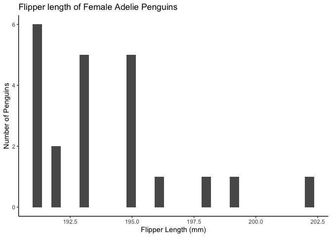

Data Wrangling Activity
================
Juan Ramirez

## Goals for the Activity

1.  Use `select()`, `arrange()`, and `filter()` to answer some questions
    about the penguins.  
2.  Connect reorganized data and graphics together.  
3.  Learn a few other `dplyr` functions such as `relocate()` and
    `rename()`.

Remember to use your resources, such as the slides, readings, and
cheatsheets for the `dplyr` package.

## Penguin Data

We have used this data in previous activities (and we will continue to
do so for a few more activities), but here we can use the `dplyr`
function `glimpse()` to remind ourselves what it looks like.

``` r
glimpse(penguins)
```

    Rows: 344
    Columns: 8
    $ species           <fct> Adelie, Adelie, Adelie, Adelie, Adelie, Adelie, Adel…
    $ island            <fct> Torgersen, Torgersen, Torgersen, Torgersen, Torgerse…
    $ bill_length_mm    <dbl> 39.1, 39.5, 40.3, NA, 36.7, 39.3, 38.9, 39.2, 34.1, …
    $ bill_depth_mm     <dbl> 18.7, 17.4, 18.0, NA, 19.3, 20.6, 17.8, 19.6, 18.1, …
    $ flipper_length_mm <int> 181, 186, 195, NA, 193, 190, 181, 195, 193, 190, 186…
    $ body_mass_g       <int> 3750, 3800, 3250, NA, 3450, 3650, 3625, 4675, 3475, …
    $ sex               <fct> male, female, female, NA, female, male, female, male…
    $ year              <int> 2007, 2007, 2007, 2007, 2007, 2007, 2007, 2007, 2007…

## Practice with `filter()`

Recall that `filter()` allows us to select specific characteristics via
row values within the data. In addition, we can use the `%>%` (pipe) to
connect our data to the function.

For example, here is the code to filter out just the Chinstrap penguins
from the data

``` r
penguins %>% 
  filter(species == "Chinstrap") 
```

    # A tibble: 68 × 8
       species   island bill_length_mm bill_depth_mm flipper_length_mm body_mass_g
       <fct>     <fct>           <dbl>         <dbl>             <int>       <int>
     1 Chinstrap Dream            46.5          17.9               192        3500
     2 Chinstrap Dream            50            19.5               196        3900
     3 Chinstrap Dream            51.3          19.2               193        3650
     4 Chinstrap Dream            45.4          18.7               188        3525
     5 Chinstrap Dream            52.7          19.8               197        3725
     6 Chinstrap Dream            45.2          17.8               198        3950
     7 Chinstrap Dream            46.1          18.2               178        3250
     8 Chinstrap Dream            51.3          18.2               197        3750
     9 Chinstrap Dream            46            18.9               195        4150
    10 Chinstrap Dream            51.3          19.9               198        3700
    # … with 58 more rows, and 2 more variables: sex <fct>, year <int>

Look at the number of rows in our filtered data frame - how many of the
penguins in our data were “Chinstrap”?

> Your Answer

We can then connect our filtered data to a graphic to plot only the
remaining data values.

``` r
penguins %>% 
  filter(species == "Chinstrap") %>% 
  ggplot(aes(x = bill_length_mm, y = sex, fill = sex)) + 
  #remember to switch to `+` once you start the ggplot2 code
  geom_boxplot() +  #create boxplot
  guides(fill = "none") +  #remove legend generated from fill =
  theme_minimal() + #change theme
  labs(x = "Bill Length (mm)",
       y = "Sex of Penguin",
       title = "Bill Length of Chinstrap Penguins by Sex") + #add labels and title
  scale_fill_viridis_d(begin = 0.25, end = 0.85) #modify default colors
```

<!-- -->

### Your Turn with `filter()`

Find the following information:

Create a data frame with just Adelie Penguins

``` r
penguins %>% 
  filter(species=="Adelie")
```

    # A tibble: 152 × 8
       species island    bill_length_mm bill_depth_mm flipper_length_mm body_mass_g
       <fct>   <fct>              <dbl>         <dbl>             <int>       <int>
     1 Adelie  Torgersen           39.1          18.7               181        3750
     2 Adelie  Torgersen           39.5          17.4               186        3800
     3 Adelie  Torgersen           40.3          18                 195        3250
     4 Adelie  Torgersen           NA            NA                  NA          NA
     5 Adelie  Torgersen           36.7          19.3               193        3450
     6 Adelie  Torgersen           39.3          20.6               190        3650
     7 Adelie  Torgersen           38.9          17.8               181        3625
     8 Adelie  Torgersen           39.2          19.6               195        4675
     9 Adelie  Torgersen           34.1          18.1               193        3475
    10 Adelie  Torgersen           42            20.2               190        4250
    # … with 142 more rows, and 2 more variables: sex <fct>, year <int>

Create a data frame with both Adelie and Chinstrap penguins

``` r
penguins %>% filter(species=="Adelie" | species=="Chinstrap")
```

    # A tibble: 220 × 8
       species island    bill_length_mm bill_depth_mm flipper_length_mm body_mass_g
       <fct>   <fct>              <dbl>         <dbl>             <int>       <int>
     1 Adelie  Torgersen           39.1          18.7               181        3750
     2 Adelie  Torgersen           39.5          17.4               186        3800
     3 Adelie  Torgersen           40.3          18                 195        3250
     4 Adelie  Torgersen           NA            NA                  NA          NA
     5 Adelie  Torgersen           36.7          19.3               193        3450
     6 Adelie  Torgersen           39.3          20.6               190        3650
     7 Adelie  Torgersen           38.9          17.8               181        3625
     8 Adelie  Torgersen           39.2          19.6               195        4675
     9 Adelie  Torgersen           34.1          18.1               193        3475
    10 Adelie  Torgersen           42            20.2               190        4250
    # … with 210 more rows, and 2 more variables: sex <fct>, year <int>

Create a data frame with just female Adelie penguins

``` r
penguins %>% filter(species=="Adelie", sex=="female")
```

    # A tibble: 73 × 8
       species island    bill_length_mm bill_depth_mm flipper_length_mm body_mass_g
       <fct>   <fct>              <dbl>         <dbl>             <int>       <int>
     1 Adelie  Torgersen           39.5          17.4               186        3800
     2 Adelie  Torgersen           40.3          18                 195        3250
     3 Adelie  Torgersen           36.7          19.3               193        3450
     4 Adelie  Torgersen           38.9          17.8               181        3625
     5 Adelie  Torgersen           41.1          17.6               182        3200
     6 Adelie  Torgersen           36.6          17.8               185        3700
     7 Adelie  Torgersen           38.7          19                 195        3450
     8 Adelie  Torgersen           34.4          18.4               184        3325
     9 Adelie  Biscoe              37.8          18.3               174        3400
    10 Adelie  Biscoe              35.9          19.2               189        3800
    # … with 63 more rows, and 2 more variables: sex <fct>, year <int>

Create a data frame of female Adelie penguins with flipper length
greater than 190mm.

``` r
penguins %>% filter(sex=="female", species=="Adelie", flipper_length_mm>"190")
```

    # A tibble: 22 × 8
       species island    bill_length_mm bill_depth_mm flipper_length_mm body_mass_g
       <fct>   <fct>              <dbl>         <dbl>             <int>       <int>
     1 Adelie  Torgersen           40.3          18                 195        3250
     2 Adelie  Torgersen           36.7          19.3               193        3450
     3 Adelie  Torgersen           38.7          19                 195        3450
     4 Adelie  Dream               36.4          17                 195        3325
     5 Adelie  Biscoe              35.5          16.2               195        3350
     6 Adelie  Torgersen           39.6          17.2               196        3550
     7 Adelie  Torgersen           40.9          16.8               191        3700
     8 Adelie  Dream               37.3          17.8               191        3350
     9 Adelie  Dream               35.7          18                 202        3550
    10 Adelie  Biscoe              35            17.9               192        3725
    # … with 12 more rows, and 2 more variables: sex <fct>, year <int>

Make a histogram of flipper length for female Adelie penguins with
flipper length greater than 190mm. Be sure to include proper labels and
titles for the histogram to clearly communicate the data represented.

``` r
penguins %>% 
  filter(species == "Adelie", sex=="female", flipper_length_mm>"190") %>% 
  ggplot() + 
  geom_histogram(aes(x = flipper_length_mm)) +
  guides(fill = "none") + 
  theme_classic() + 
  labs(x = "Flipper Length (mm)",
       y = "Number of Penguins",
       title = "Flipper length of Female Adelie Penguins") + 
  scale_fill_viridis_d(begin = 0.25, end = 0.85) 
```

    `stat_bin()` using `bins = 30`. Pick better value with `binwidth`.

<!-- -->

## Practice with `select()`

Recall that `select()` allows us to select specific columns within the
data. In addition, we can use the `%>%` (pipe) to connect our data to
the function.

For example, here is the code to select just the species and sex
variables:

``` r
penguins %>% 
  select(species, sex)
```

    # A tibble: 344 × 2
       species sex   
       <fct>   <fct> 
     1 Adelie  male  
     2 Adelie  female
     3 Adelie  female
     4 Adelie  <NA>  
     5 Adelie  female
     6 Adelie  male  
     7 Adelie  female
     8 Adelie  male  
     9 Adelie  <NA>  
    10 Adelie  <NA>  
    # … with 334 more rows

### Your Turn with `select()`

Find the following information:

Select the columns that contain species, body mass, and sex

``` r
penguins %>% select(species, body_mass_g, sex)
```

    # A tibble: 344 × 3
       species body_mass_g sex   
       <fct>         <int> <fct> 
     1 Adelie         3750 male  
     2 Adelie         3800 female
     3 Adelie         3250 female
     4 Adelie           NA <NA>  
     5 Adelie         3450 female
     6 Adelie         3650 male  
     7 Adelie         3625 female
     8 Adelie         4675 male  
     9 Adelie         3475 <NA>  
    10 Adelie         4250 <NA>  
    # … with 334 more rows

Select the columns that end with “mm”

``` r
penguins %>% select(ends_with("mm"))
```

    # A tibble: 344 × 3
       bill_length_mm bill_depth_mm flipper_length_mm
                <dbl>         <dbl>             <int>
     1           39.1          18.7               181
     2           39.5          17.4               186
     3           40.3          18                 195
     4           NA            NA                  NA
     5           36.7          19.3               193
     6           39.3          20.6               190
     7           38.9          17.8               181
     8           39.2          19.6               195
     9           34.1          18.1               193
    10           42            20.2               190
    # … with 334 more rows

Select all columns excluding year

``` r
penguins %>% select(-c(year))
```

    # A tibble: 344 × 7
       species island    bill_length_mm bill_depth_mm flipper_length_mm body_mass_g
       <fct>   <fct>              <dbl>         <dbl>             <int>       <int>
     1 Adelie  Torgersen           39.1          18.7               181        3750
     2 Adelie  Torgersen           39.5          17.4               186        3800
     3 Adelie  Torgersen           40.3          18                 195        3250
     4 Adelie  Torgersen           NA            NA                  NA          NA
     5 Adelie  Torgersen           36.7          19.3               193        3450
     6 Adelie  Torgersen           39.3          20.6               190        3650
     7 Adelie  Torgersen           38.9          17.8               181        3625
     8 Adelie  Torgersen           39.2          19.6               195        4675
     9 Adelie  Torgersen           34.1          18.1               193        3475
    10 Adelie  Torgersen           42            20.2               190        4250
    # … with 334 more rows, and 1 more variable: sex <fct>

## New function `relocate()`

We can use `relocate()` to move columns around, without messing with
rows or groups. Here are some useful tips:

-   Use `.before` or `.after` to move a column to before or after
    another (by name or class)  
-   If a single column is within the function (e.g. `relocate(col_A)`),
    that column is moved to the front

For example, the following will move `year` to the front

``` r
penguins %>% 
  relocate(year)
```

    # A tibble: 344 × 8
        year species island    bill_length_mm bill_depth_mm flipper_length_mm
       <int> <fct>   <fct>              <dbl>         <dbl>             <int>
     1  2007 Adelie  Torgersen           39.1          18.7               181
     2  2007 Adelie  Torgersen           39.5          17.4               186
     3  2007 Adelie  Torgersen           40.3          18                 195
     4  2007 Adelie  Torgersen           NA            NA                  NA
     5  2007 Adelie  Torgersen           36.7          19.3               193
     6  2007 Adelie  Torgersen           39.3          20.6               190
     7  2007 Adelie  Torgersen           38.9          17.8               181
     8  2007 Adelie  Torgersen           39.2          19.6               195
     9  2007 Adelie  Torgersen           34.1          18.1               193
    10  2007 Adelie  Torgersen           42            20.2               190
    # … with 334 more rows, and 2 more variables: body_mass_g <int>, sex <fct>

Or we could move `year` after `island`

``` r
penguins %>% 
  relocate(year, .after = island)
```

    # A tibble: 344 × 8
       species island     year bill_length_mm bill_depth_mm flipper_length_mm
       <fct>   <fct>     <int>          <dbl>         <dbl>             <int>
     1 Adelie  Torgersen  2007           39.1          18.7               181
     2 Adelie  Torgersen  2007           39.5          17.4               186
     3 Adelie  Torgersen  2007           40.3          18                 195
     4 Adelie  Torgersen  2007           NA            NA                  NA
     5 Adelie  Torgersen  2007           36.7          19.3               193
     6 Adelie  Torgersen  2007           39.3          20.6               190
     7 Adelie  Torgersen  2007           38.9          17.8               181
     8 Adelie  Torgersen  2007           39.2          19.6               195
     9 Adelie  Torgersen  2007           34.1          18.1               193
    10 Adelie  Torgersen  2007           42            20.2               190
    # … with 334 more rows, and 2 more variables: body_mass_g <int>, sex <fct>

### Your Turn with `relocate()`

Move sex after species

``` r
penguins %>% relocate(sex, .after=species)
```

    # A tibble: 344 × 8
       species sex    island    bill_length_mm bill_depth_mm flipper_length_mm
       <fct>   <fct>  <fct>              <dbl>         <dbl>             <int>
     1 Adelie  male   Torgersen           39.1          18.7               181
     2 Adelie  female Torgersen           39.5          17.4               186
     3 Adelie  female Torgersen           40.3          18                 195
     4 Adelie  <NA>   Torgersen           NA            NA                  NA
     5 Adelie  female Torgersen           36.7          19.3               193
     6 Adelie  male   Torgersen           39.3          20.6               190
     7 Adelie  female Torgersen           38.9          17.8               181
     8 Adelie  male   Torgersen           39.2          19.6               195
     9 Adelie  <NA>   Torgersen           34.1          18.1               193
    10 Adelie  <NA>   Torgersen           42            20.2               190
    # … with 334 more rows, and 2 more variables: body_mass_g <int>, year <int>

Move body mass before bill length

``` r
penguins %>% relocate(body_mass_g, .before = bill_length_mm)
```

    # A tibble: 344 × 8
       species island    body_mass_g bill_length_mm bill_depth_mm flipper_length_mm
       <fct>   <fct>           <int>          <dbl>         <dbl>             <int>
     1 Adelie  Torgersen        3750           39.1          18.7               181
     2 Adelie  Torgersen        3800           39.5          17.4               186
     3 Adelie  Torgersen        3250           40.3          18                 195
     4 Adelie  Torgersen          NA           NA            NA                  NA
     5 Adelie  Torgersen        3450           36.7          19.3               193
     6 Adelie  Torgersen        3650           39.3          20.6               190
     7 Adelie  Torgersen        3625           38.9          17.8               181
     8 Adelie  Torgersen        4675           39.2          19.6               195
     9 Adelie  Torgersen        3475           34.1          18.1               193
    10 Adelie  Torgersen        4250           42            20.2               190
    # … with 334 more rows, and 2 more variables: sex <fct>, year <int>

### New Function `rename()`

We can use `rename()` to change the name of one or more columns.
Generally, it’ll look something like this:

`dataframe %>% rename(new_name = old_name)`

For example, we can rename `island` to `palmer_island`

``` r
penguins %>% 
  rename(palmer_island = island)
```

    # A tibble: 344 × 8
       species palmer_island bill_length_mm bill_depth_mm flipper_length_mm
       <fct>   <fct>                  <dbl>         <dbl>             <int>
     1 Adelie  Torgersen               39.1          18.7               181
     2 Adelie  Torgersen               39.5          17.4               186
     3 Adelie  Torgersen               40.3          18                 195
     4 Adelie  Torgersen               NA            NA                  NA
     5 Adelie  Torgersen               36.7          19.3               193
     6 Adelie  Torgersen               39.3          20.6               190
     7 Adelie  Torgersen               38.9          17.8               181
     8 Adelie  Torgersen               39.2          19.6               195
     9 Adelie  Torgersen               34.1          18.1               193
    10 Adelie  Torgersen               42            20.2               190
    # … with 334 more rows, and 3 more variables: body_mass_g <int>, sex <fct>,
    #   year <int>

### Your Turn with `rename()`

Change the name of year to `study_yr` and the name of body mass to
`mass`

``` r
penguins %>% rename(study_yr=year)
```

    # A tibble: 344 × 8
       species island    bill_length_mm bill_depth_mm flipper_length_mm body_mass_g
       <fct>   <fct>              <dbl>         <dbl>             <int>       <int>
     1 Adelie  Torgersen           39.1          18.7               181        3750
     2 Adelie  Torgersen           39.5          17.4               186        3800
     3 Adelie  Torgersen           40.3          18                 195        3250
     4 Adelie  Torgersen           NA            NA                  NA          NA
     5 Adelie  Torgersen           36.7          19.3               193        3450
     6 Adelie  Torgersen           39.3          20.6               190        3650
     7 Adelie  Torgersen           38.9          17.8               181        3625
     8 Adelie  Torgersen           39.2          19.6               195        4675
     9 Adelie  Torgersen           34.1          18.1               193        3475
    10 Adelie  Torgersen           42            20.2               190        4250
    # … with 334 more rows, and 2 more variables: sex <fct>, study_yr <int>

## Practice with `arrange()`

We can use `arrange()` to reorder your data based on the values of
specific variable or variables from smallest to largest. The addition of
`desc()` can reverse the order from largest to smallest.

For example, we can arrange the penguins by body mass

``` r
penguins %>% 
  arrange(body_mass_g)
```

    # A tibble: 344 × 8
       species   island    bill_length_mm bill_depth_mm flipper_length_… body_mass_g
       <fct>     <fct>              <dbl>         <dbl>            <int>       <int>
     1 Chinstrap Dream               46.9          16.6              192        2700
     2 Adelie    Biscoe              36.5          16.6              181        2850
     3 Adelie    Biscoe              36.4          17.1              184        2850
     4 Adelie    Biscoe              34.5          18.1              187        2900
     5 Adelie    Dream               33.1          16.1              178        2900
     6 Adelie    Torgersen           38.6          17                188        2900
     7 Chinstrap Dream               43.2          16.6              187        2900
     8 Adelie    Biscoe              37.9          18.6              193        2925
     9 Adelie    Dream               37.5          18.9              179        2975
    10 Adelie    Dream               37            16.9              185        3000
    # … with 334 more rows, and 2 more variables: sex <fct>, year <int>

Remember we can also combine multiple functions in a pipe

``` r
penguins %>% 
  filter(island == "Dream") %>% 
  arrange(body_mass_g) %>% 
  select(species, sex, body_mass_g)
```

    # A tibble: 124 × 3
       species   sex    body_mass_g
       <fct>     <fct>        <int>
     1 Chinstrap female        2700
     2 Adelie    female        2900
     3 Chinstrap female        2900
     4 Adelie    <NA>          2975
     5 Adelie    female        3000
     6 Adelie    female        3000
     7 Adelie    female        3050
     8 Adelie    female        3100
     9 Adelie    female        3150
    10 Adelie    female        3175
    # … with 114 more rows

### Your Turn with `arrange()`

Use the above functions to answer the following questions:

What is the sex and species of the heaviest penguin in the data?

``` r
penguins %>%
  arrange(body_mass_g)
```

    # A tibble: 344 × 8
       species   island    bill_length_mm bill_depth_mm flipper_length_… body_mass_g
       <fct>     <fct>              <dbl>         <dbl>            <int>       <int>
     1 Chinstrap Dream               46.9          16.6              192        2700
     2 Adelie    Biscoe              36.5          16.6              181        2850
     3 Adelie    Biscoe              36.4          17.1              184        2850
     4 Adelie    Biscoe              34.5          18.1              187        2900
     5 Adelie    Dream               33.1          16.1              178        2900
     6 Adelie    Torgersen           38.6          17                188        2900
     7 Chinstrap Dream               43.2          16.6              187        2900
     8 Adelie    Biscoe              37.9          18.6              193        2925
     9 Adelie    Dream               37.5          18.9              179        2975
    10 Adelie    Dream               37            16.9              185        3000
    # … with 334 more rows, and 2 more variables: sex <fct>, year <int>

``` r
#Heaviest is the Gentoo species on the Biscoe island, at about 6300g
```

What is the sex and body mass of the heaviest Chinstrap penguin?

``` r
penguins %>%
  arrange(body_mass_g) %>% 
  select(sex, species, body_mass_g) %>% 
  filter(species=="Chinstrap")
```

    # A tibble: 68 × 3
       sex    species   body_mass_g
       <fct>  <fct>           <int>
     1 female Chinstrap        2700
     2 female Chinstrap        2900
     3 female Chinstrap        3200
     4 female Chinstrap        3250
     5 male   Chinstrap        3250
     6 female Chinstrap        3250
     7 male   Chinstrap        3300
     8 female Chinstrap        3300
     9 female Chinstrap        3325
    10 female Chinstrap        3350
    # … with 58 more rows

``` r
#Male Chinstrap, 4800g
```

What is the sex and body mass of the smallest Chinstrap penguin on Dream
island?

``` r
penguins %>%
  filter(species=="Chinstrap", island=="Dream") %>% 
  select(sex, body_mass_g) %>% 
  arrange(body_mass_g)
```

    # A tibble: 68 × 2
       sex    body_mass_g
       <fct>        <int>
     1 female        2700
     2 female        2900
     3 female        3200
     4 female        3250
     5 male          3250
     6 female        3250
     7 male          3300
     8 female        3300
     9 female        3325
    10 female        3350
    # … with 58 more rows

``` r
#Female, 2700g
```

## Wrap-Up

The functions of `dplyr` allow you to quickly and efficiently wrangle
your data based on various characteristics. Once you have finished with
the exercises, knit the file the HTML and submit all files.
